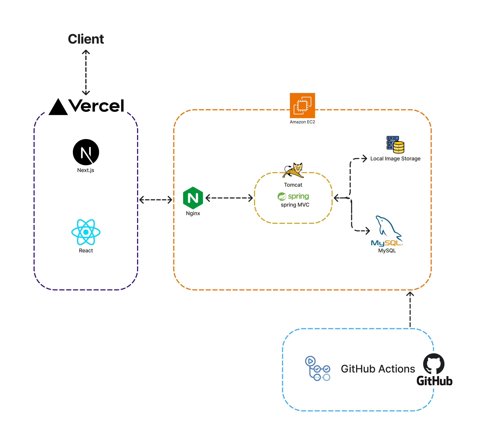
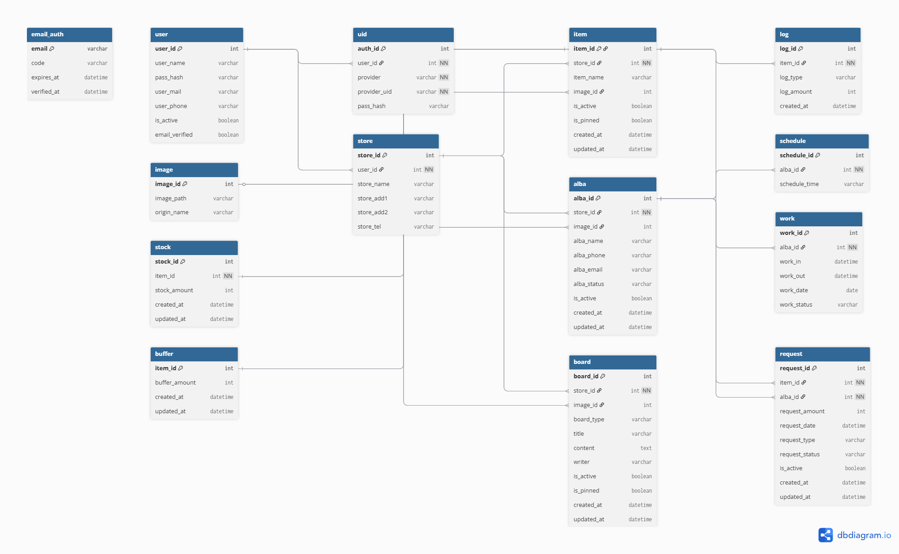

# 재고키퍼 (JaegoKeeper Backend)

> 점포 운영자가 재고, 알바, 스케줄, 요청을 한 곳에서 관리할 수 있도록 만든 Spring MVC 기반 백엔드 서비스

<br/>

## 목차
- [팀원](#팀원)
- [기술 스택](#기술-스택)
- [프로젝트 관련 주소](#프로젝트-관련-주소)
- [내 프로젝트 아키텍처 및 배포 아키텍처](#내-프로젝트-아키텍처-및-배포-아키텍처)
- [ERD](#erd)
- [서비스 소개](#서비스-소개)
- [프로젝트 배경](#프로젝트-배경)
- [서비스 핵심 기능](#서비스-핵심-기능)
- [프로젝트 구조](#프로젝트-구조)
- [기술적 도전과 해결](#기술적-도전과-해결)
- [트러블슈팅](#트러블슈팅)
- [최근 개선 사항](#최근-개선-사항)

---

## 팀원


<h4 align="center">Backend</h4>

<div align="center">

| 이승환 | 이하성 | 박소정 |
| --- | --- | --- |
| [@hwanzanghagetne](https://github.com/hwanzanghagetne) | [@revy7289](https://github.com/revy7289) | [@ssojeongg](https://github.com/ssojeongg) |
|  |  |  |

</div>

<h4 align="center">Frontend</h4>

<div align="center">

| 김수연 | 정재훈 |
| --- | --- |
| [@kimsudang](https://github.com/kimsudang) | [@jaehunGit](https://github.com/jaehunGit) |
|  |  |

</div>

---

## 기술 스택

### Backend


### Frontend


### Infra / Deploy


---

## 프로젝트 관련 주소

<div align="center">

| 문서 |
|:---:|
| [프론트엔드 배포 주소](https://github.com/Jachodan/jachodan-next) |
| [백엔드 API 문서](http://98.84.8.224/swagger-ui.html) |
| [프로젝트 노션](https://www.notion.so/Jachodan-228b76bc91b880c2b4e6c54facfd6395) |

</div>

---

## 내 프로젝트 아키텍처 및 배포 아키텍처

<p align="center">
  
</p>

- `Client`는 `Vercel`에 배포된 `Next.js(React)` 프론트엔드에 접속하고, API 요청은 백엔드로 전달됩니다.
- 백엔드는 `EC2` 내부에서 `Nginx(Reverse Proxy)` -> `Tomcat(8080)` -> `Spring MVC` 흐름으로 동작합니다.
- `Spring MVC`는 `MySQL`과 `Local Image Storage`를 사용하며, 배포는 `GitHub Actions` 기반으로 자동화했습니다.

---

## ERD

<p align="center">
  
</p>

---

## 서비스 소개

재고키퍼는 소상공인/매장 운영 환경에서 자주 발생하는 운영 관리 분산 문제를 해결하기 위한 서비스입니다.
인증된 사용자 기준으로 점포 범위를 강제하고, 상품/재고/요청/알바/스케줄 업무를 하나의 API 서버에서 통합 관리합니다.

---

## 프로젝트 배경

소규모 요식업 아르바이트를 하면서 매장 실재고 파악이 늦어 발주, 요청 처리, 근무 커뮤니케이션이 어긋나는 문제를 경험했습니다.
이 경험을 바탕으로 점포 단위의 재고/요청/근무 데이터를 한곳에서 관리할 수 있는 백엔드 서비스를 기획했습니다.

---

## 서비스 핵심 기능

### 1) 인증/회원
- 로컬 로그인, 소셜 로그인(Google/Kakao/Naver)
- 이메일 인증 기반 회원가입(Onboarding)
- 세션 기반 인증 + 로그인 상태 검증 API

### 2) 점포 운영
- 상품(Item) 등록/수정/조회
- 재고(Stock) 입출고 및 수량 관리
- 요청(Request) 등록/조회/처리

### 3) 알바/스케줄
- 알바 등록/수정/상태 관리
- 스케줄 등록 및 근무 흐름 관리

### 4) 커뮤니티/파일
- 게시판(Board) CRUD
- 이미지 업로드/조회

---

## 프로젝트 구조

<div align="center">

| 패키지 | 역할 |
|:---:|:---|
| `auth` | 로그인/세션/소셜 인증 |
| `onboarding` | 사장 회원가입 플로우 |
| `item` / `stock` / `request` | 점포 운영 핵심 도메인 |
| `alba` / `schedule` | 인력/근무 관리 |
| `board` | 게시판 기능 |
| `image` | 이미지 업로드/조회 |
| `store` / `user` / `email` | 점포/회원/메일 기능 |
| `exception` | `ErrorCode`, 전역 예외 처리 |
| `config` | Async, Swagger, Mail 설정 |
| `mappers` | MyBatis SQL 매퍼 XML |

</div>

<details>
<summary>패키지 트리 보기</summary>

```text
src/main/java/com/jaegokeeper
├─ auth
├─ onboarding
├─ item / stock / request
├─ alba / schedule
├─ board
├─ image
├─ store / user / email
├─ exception
└─ config

src/main/resources/mappers
```

</details>

---

## 기술적 도전과 해결

### 1) 점포 권한 경계 일관화
- 도전: 멀티 점포 구조에서 `storeId` 권한 검증이 누락되면 타 점포 데이터 접근 위험이 발생
- 해결:
  - `SessionInterceptor`에서 세션 로그인/경로 `storeId` 1차 검증
  - `Item/Stock/Request/Alba` 서비스에서 `validateStoreAccess`로 2차 검증
- 결과: 권한 불일치 요청을 인터셉터+서비스 이중 레이어에서 차단

### 2) 파일 저장과 DB 트랜잭션 정합성
- 도전: 이미지 업로드는 파일시스템, 비즈니스 데이터는 DB에 저장되어 실패 시 정합성 깨질 수 있음
- 해결:
  - `ImageService`에서 상대경로 저장, 경로 traversal 방어, MIME 재검증 적용
  - `ItemService`, `AlbaService`에서 업로드 이후 예외 발생 시 파일 cleanup 처리
- 결과: 실패 시 고아 파일 발생 가능성을 줄이고 업로드 안정성 개선

### 3) 재고 감소 동시성 보호
- 도전: 동시 요청에서 재고를 애플리케이션 로직으로만 차감하면 음수 재고 위험
- 해결:
  - SQL 레벨에서 `decreaseQuantity ... AND s.stock_amount >= #{amount}` 조건으로 원자적 차감
  - 업데이트 행 수 기반으로 `STOCK_QUANTITY_NOT_ENOUGH` 예외 반환
- 결과: 동시 출고 요청에서도 재고 하한을 DB 레벨에서 보장

---

## 트러블슈팅

### 1) 알바 등록 500 (`keyProperty` 매핑 실패)
- 증상: `POST /stores/{storeId}/albas` 호출 시 500
- 원인: MyBatis `useGeneratedKeys="true" keyProperty="albaId"`인데 DTO에 setter 대상 필드 부재
- 조치: `AlbaRegisterRequest`에 `albaId` 추가, generated key를 스케줄 등록 흐름에 연계
- 확인: 신규 등록/중복 검증/스케줄 생성까지 WORKLOG 기준 검증 완료

### 2) 소셜 로그인 400/500 연속 장애
- 증상: 소셜 로그인 완료 API에서 400, 이후 500 전환
- 원인: Verifier 빈 등록 누락 + 신규 DB 스키마(`uid` 등) 불일치
- 조치: Verifier 컴포넌트 등록, 테스트 전용 Verifier 분리, 스키마/제약 조건 정리
- 확인: 운영 로그 기준 소셜 로그인 정상화

### 3) 수동 배포 반복으로 인한 운영 리스크
- 증상: 수동 배포 과정에서 환경별 실패 포인트 다수 발생
- 원인: 빌드/환경변수/프로세스 생명주기 관리가 수동 절차에 의존
- 조치: self-hosted runner 기반 배포 절차 정리, Maven/환경변수/헬스체크 보완
- 확인: WORKLOG에 배포 성공 이력과 검증 로그 기록

---

## 최근 개선 사항

- Item/Stock/Request 도메인에 점포 권한 검증 패턴 일관화
- 이메일 인증 예외 처리 강화(Null 반환 케이스 방어)
- 이미지 저장 경로 정책 개선(상대 경로 저장 + 실패 cleanup)
- 알바 등록 흐름 정리(컨트롤러 업로드 로직 축소, 서비스 orchestration 강화)
