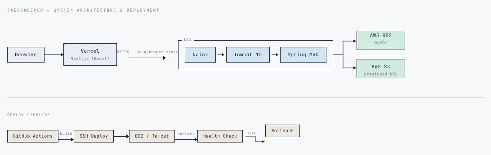
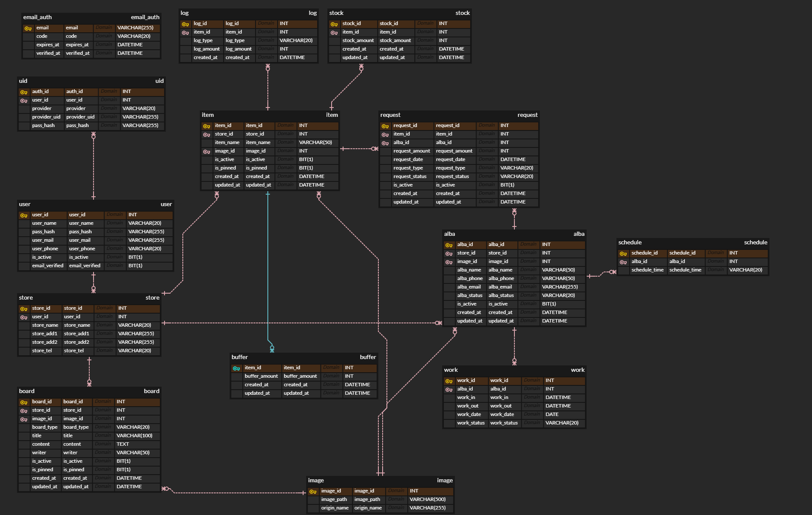

# 재고키퍼 (JaegoKeeper Backend)

> 점포 운영자가 재고, 알바, 스케줄, 요청을 한 곳에서 관리할 수 있도록 만든 Spring MVC 기반 백엔드 서비스

<br/>

## 목차
- [팀원](#팀원)
- [기술 스택](#기술-스택)
- [프로젝트 관련 주소](#프로젝트-관련-주소)
- [시스템 아키텍처 및 배포 구조](#시스템-아키텍처-및-배포-구조)
- [ERD](#erd)
- [서비스 소개](#서비스-소개)
- [프로젝트 배경](#프로젝트-배경)
- [서비스 핵심 기능](#서비스-핵심-기능)
- [프로젝트 구조](#프로젝트-구조)
- [기술적 도전과 해결](#기술적-도전과-해결)
- [트러블슈팅](#트러블슈팅)

---

## 팀원


<h4 align="center">Backend</h4>

<div align="center">

| 이승환 | 이하성 | 박소정 |
| --- | --- | --- |
| [@hwanzanghagetne](https://github.com/hwanzanghagetne) | [@revy7289](https://github.com/revy7289) | [@ssojeongg](https://github.com/ssojeongg) |
|  |  |  |

</div>

<h4 align="center">Frontend</h4>

<div align="center">

| 김수연 | 정재훈 |
| --- | --- |
| [@kimsudang](https://github.com/kimsudang) | [@jaehunGit](https://github.com/jaehunGit) |
|  |  |

</div>

---

## 기술 스택

### Backend

-6DB33F?style=flat-square&logo=spring&logoColor=white)


### Frontend


### Infra / Deploy


-527FFF?style=flat-square&logo=amazonrds&logoColor=white)


---

## 프로젝트 관련 주소

<div align="center">

| 문서 |
|:---:|
| [프론트엔드 배포 주소](https://jaegokeeper-blush.vercel.app/) |
| [백엔드 배포 주소](https://jaegokeeper.store) |
| [API 문서 (Swagger UI)](https://jaegokeeper.store/swagger-ui/index.html) |
| [프론트엔드 GitHub](https://github.com/Jachodan/jachodan-next) |
| [백엔드 GitHub](https://github.com/hwanzanghagetne/jaegokeeper) |
| [프로젝트 노션](https://www.notion.so/Jachodan-228b76bc91b880c2b4e6c54facfd6395) |

</div>

---

## 시스템 아키텍처 및 배포 구조

<p align="center">
   Vercel(Next.js/React) -> HTTPS(jaegokeeper.store) -> EC2(Nginx -> Tomcat 10 -> Spring MVC) -> AWS RDS(MySQL) / AWS S3(presigned URL). 배포 파이프라인: GitHub Actions -> SSH Deploy -> EC2/Tomcat -> Health Check(실패 시 Rollback)" width="1000" />
</p>

- `Client`는 `Vercel`에 배포된 `Next.js(React)` 프론트엔드(`https://jaegokeeper-blush.vercel.app`)에 접속하고, API 요청은 자체 도메인(`https://jaegokeeper.store`)의 백엔드로 전달됩니다.
- 백엔드는 `EC2` 위에서 `Nginx` -> `Tomcat 10(8080)` -> `Spring MVC` 흐름으로 동작합니다.
- DB(`MySQL`)는 `EC2`와 분리된 `AWS RDS`를 사용하며, RDS는 EC2 보안 그룹에서만 접근 가능하도록 제한하고 퍼블릭 액세스를 차단했습니다.
- 이미지는 로컬 파일시스템 대신 `AWS S3`에 저장하고, 조회 시 presigned URL로 리다이렉트합니다. EC2에 부여한 IAM 역할로 인증하며 별도 액세스 키는 관리하지 않습니다.
- 배포는 `GitHub Actions`(GitHub 호스티드 러너에서 빌드 → SSH로 EC2에 WAR 전달 → Tomcat 재기동)로 자동화했고, 헬스체크 실패 시 이전 버전으로 자동 롤백합니다.

### 로컬 Docker 실행

로컬에서도 운영과 같은 Java 17, Tomcat 10.1 환경으로 실행할 수 있습니다.

1. `.env.example`을 `.env.local`로 복사하고 실제 환경변수 값을 입력합니다.
2. 프로젝트 루트에서 `docker compose up --build -d`를 실행합니다.
3. `http://localhost:8080/`에서 `server is running` 응답을 확인합니다.
4. 종료할 때는 `docker compose down`을 실행합니다.

Docker 내부에서 호스트 PC의 MySQL에 접근할 때는 `DB_URL`의 호스트로 `host.docker.internal`을 사용합니다. RDS를 사용한다면 해당 RDS 주소를 그대로 입력합니다. AWS 키는 로컬에서 S3 기능을 확인할 때만 사용하며 저장소에 커밋하지 않습니다.

---

## ERD

<p align="center">
  
</p>

---

## 서비스 소개

재고키퍼는 소상공인/매장 운영 환경에서 자주 발생하는 운영 관리 분산 문제를 해결하기 위한 서비스입니다.
인증된 사용자 기준으로 점포 범위를 강제하고, 상품/재고/요청/알바/스케줄 업무를 하나의 API 서버에서 통합 관리합니다.

---

## 프로젝트 배경

소규모 매장에서 재고 확인, 발주 요청, 근무 커뮤니케이션이 분산되어 발생하는 운영 비효율을 줄이기 위해 기획했습니다.

---

## 서비스 핵심 기능

### 1) 인증/회원
- 로컬 로그인(이메일/비밀번호), 소셜 로그인(Google/Kakao)
- 신규 소셜 유저는 자동 가입 대신 추가정보(점주/매장) 입력 후 가입 완료, 동일 verified email 존재 시 기존 계정에 연동
- 이메일 인증 기반 회원가입(Onboarding)
- 세션 기반 인증 + 로그인 상태 검증 API

### 2) 점포 운영
- 상품(Item) 등록/수정/조회
- 재고(Stock) 입출고 및 수량 관리
- 요청(Request) 등록/조회/처리

### 3) 알바/스케줄
- 알바 등록/수정/상태 관리
- 스케줄 등록 및 근무 흐름 관리

### 4) 커뮤니티/파일
- 게시판(Board) CRUD
- 이미지 업로드/조회

---

## 프로젝트 구조

<div align="center">

| 패키지 | 역할 |
|:---:|:---|
| `auth` | 로컬/소셜 로그인, 세션 생성/조회/로그아웃 처리 |
| `onboarding` | 이메일 인증 기반 사장 회원가입 및 초기 점포 생성 |
| `item` / `stock` / `request` | 상품 관리, 재고 입출고, 매장 요청 등록/상태 변경 |
| `alba` / `schedule` | 알바 등록/수정/삭제와 근무 스케줄/출퇴근 기록 |
| `board` | 공지/게시글 등록·수정·조회 |
| `image` | 이미지 업로드, 경로 검증, 파일 조회/정리 |
| `store` / `user` / `email` | 점포/사용자 정보 수정, 이메일 인증 코드 발송/검증 |
| `mail` | 실제 메일 발송 인프라(Gmail SMTP, 비동기, 재시도) — `email`(인증코드 검증 로직)과 역할 분리 |
| `common` | 공용 DTO(페이징), AOP(`@Timer`), 헬스체크 |
| `exception` | 공통 에러코드 정의 및 전역 예외 응답 처리 |
| `config` | 비동기, springdoc(OpenAPI), Jackson, Mail 템플릿, S3 클라이언트 등 인프라 설정 |
| `mappers` | MyBatis SQL 매퍼 XML |

</div>

<details>
<summary>패키지 트리 보기</summary>

```text
src/main/java/com/jaegokeeper
├─ alba
├─ auth
├─ board
├─ common
├─ config
├─ email
├─ exception
├─ image
├─ item
├─ mail
├─ onboarding
├─ request
├─ schedule
├─ stock
├─ store
└─ user

src/main/resources/mappers
├─ alba
├─ board
├─ email
├─ image
├─ item
├─ request
├─ schedule
├─ stock
├─ store
└─ user
```

</details>

---

## 기술적 도전과 해결

### 1) 재고 출고 동시성 문제를 DB 원자 연산으로 해결
- 기존 방식: `SELECT`로 재고를 조회한 뒤 Java 로직에서 차감 가능 여부 판단
- 문제: 동시에 여러 요청이 들어오면 같은 재고 수량을 기준으로 출고 가능하다고 판단할 수 있음
- 개선: `UPDATE ... SET stock_amount = stock_amount - #{amount} WHERE ... AND stock_amount >= #{amount}`
- 선택 이유: 동시성 제어를 애플리케이션이 아닌 DB 조건식에서 처리해야 경쟁 상태를 줄일 수 있기 때문
- 결과: 업데이트 성공 행 수로 출고 성공/실패를 판별하고, 부족 시 `STOCK_QUANTITY_NOT_ENOUGH`를 반환

### 2) 파일 저장과 DB 트랜잭션 정합성
- 도전: 이미지 업로드는 파일시스템, 비즈니스 데이터는 DB에 저장되어 실패 시 정합성 깨질 수 있음
- 해결:
  - `ImageService`에서 상대경로 저장, 경로 traversal 방어, MIME 재검증 적용
  - `ItemService`, `AlbaService`에서 업로드 이후 예외 발생 시 파일 cleanup 처리
- 선택 이유: 파일시스템은 DB 트랜잭션으로 롤백되지 않으므로 서비스 계층에서 실패 cleanup을 명시적으로 처리
- 결과: 실패 시 고아 파일 발생 가능성을 줄이고 업로드 안정성 개선

### 3) 수동 배포 리스크를 자동 배포로 전환
- 도전: 수동 배포 과정에서 빌드/환경변수/프로세스 재시작 단계가 반복되며 운영 실수 가능성이 높았음
- 해결: `GitHub Actions`(GitHub 호스티드 러너에서 빌드 → SSH로 EC2에 WAR 전달 → Tomcat 재기동) 배포 파이프라인 구성, 헬스체크 실패 시 자동 롤백 추가
- 선택 이유: 반복 가능한 절차를 코드화해야 환경 의존성과 휴먼 에러를 줄일 수 있기 때문
- 결과: 배포 과정을 표준화하고 실패 원인을 로그 기준으로 빠르게 추적할 수 있는 구조로 개선

---

## 트러블슈팅

### 1) 알바 등록 500 (`keyProperty` 매핑 실패)
- 증상: `POST /stores/{storeId}/albas` 호출 시 500
- 원인: MyBatis `useGeneratedKeys="true" keyProperty="albaId"`인데 DTO에 setter 대상 필드 부재
- 조치: `AlbaRegisterRequest`에 `albaId` 추가, generated key를 스케줄 등록 흐름에 연계
- 확인: 신규 등록/중복 검증/스케줄 생성까지 WORKLOG 기준 검증 완료
- 배운 점: generated key를 사용하는 경우 Mapper 설정뿐 아니라 DTO 필드와 후속 비즈니스 흐름까지 함께 설계해야 함

### 2) 소셜 로그인 400/500 연속 장애
- 증상: 소셜 로그인 완료 API에서 400, 이후 500 전환
- 원인: Verifier 빈 등록 누락 + 신규 DB 스키마(`uid` 등) 불일치
- 조치: Verifier 컴포넌트 등록, 테스트 전용 Verifier 분리, 스키마/제약 조건 정리
- 확인: 운영 로그 기준 소셜 로그인 정상화
- 배운 점: 인증 장애는 앱 코드와 DB 스키마를 분리해서 단계적으로 검증해야 원인을 빠르게 특정할 수 있음

---


